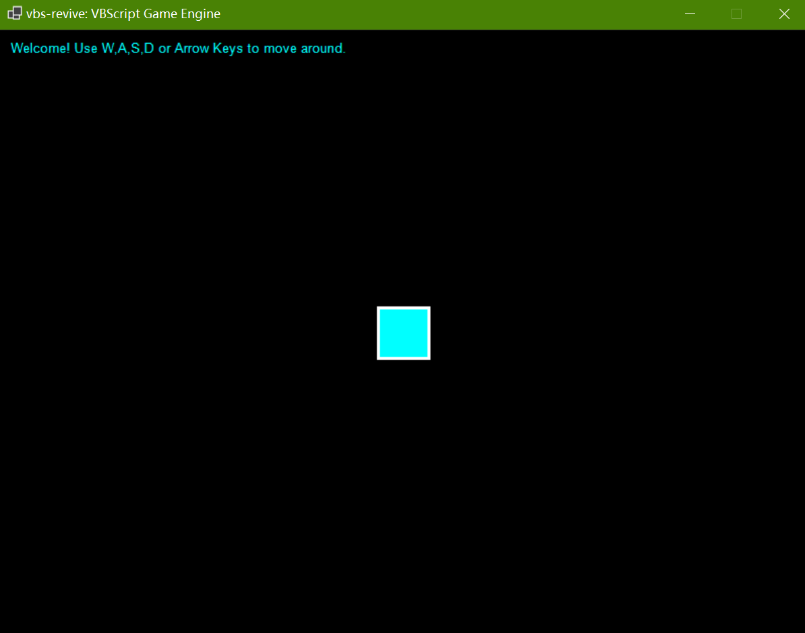

# vbs-revive: VBScript Game Engine Created With VB.NET WinForms



## Description
`vbs-revive` is a lightweight game engine that allows developers to create games using VBScript as the scripting language. Despite Microsoft's official deprecation of VBScript, this engine remains a viable option for game development to this day.

The game engine, built with VB.NET and Windows Forms, not only provides a simple interface for rapid game prototyping, as well as for learning game development concepts, but also leverages the power of VBScript to create dynamic and interactive games, while remaining easy to use and extend.

## Features

- **VBScript-based scripting**: Write your game logic in familiar VBScript
- **Asset management**: Support for images, sounds, music, and fonts
- **Input handling**: Keyboard and mouse input support with state tracking
- **Graphics rendering**: 2D graphics with drawing primitives
- **Mathematical utilities**: Vector and rectangle classes for game geometry
- **Audio playback**: Support for sound effects and background music
- **Cross-platform dependencies**: Uses .NET 10.0 for modern compatibility

## Architecture Overview

The engine consists of several key components:

### Core Components
- **AppMain.vb**: The main application class that handles the game window, script engine, and game loop
- **InputStateHandler.vb**: Tracks keyboard and mouse states with support for key down, held, and up events
- **EngineAssets.vb**: Asset management classes for sounds, music, fonts, and images
- **Geometrics.vb**: Mathematical classes for 2D vectors and rectangles

### Asset Classes
- **`SoundAsset`**: Handles WAV audio files in the `sounds/` directory
- **`MusicAsset`**: Manages MP3 background music in the `music/` directory
- **`FontAsset`**: Loads TTF fonts from the `fonts/` directory
- **`ImageAsset`**: Supports PNG images in the `images/` directory

### Geometry Classes
- **`Vec2i` / `Vec2f`**: 2D vector classes for integer and floating-point coordinates
- **`Recti` / `Rectf`**: Rectangle classes with methods for collision detection and drawing

## Getting Started
```bash
git clone https://github.com/Pac-Dessert1436/vbs-revive.git
cd vbs-revive
```

1. **Prerequisites**: Ensure you have [.NET 10.0](https://dotnet.microsoft.com/download/dotnet/10.0) or later installed
2. **Build**: Restore dependencies with `dotnet restore` command, then compile the project with `dotnet build` command
3. **Run**: Execute the application using `dotnet run` command, or click the `vbs-revive.exe` file in the `bin/Debug/net10.0` directory
4. **Publish**: To create a standalone executable, use `dotnet publish` command

Upon first run, the engine creates default asset directories (`sounds`, `images`, `fonts`, `music`) and generates a sample `gamemain.vbs` script.

## Game Scripting API

Your game logic goes in `gamemain.vbs` with three main functions:

- `Initialize()`: Called once at startup
- `Update()`: Called every frame for game logic
- `Render(g)`: Called every frame for drawing

### Example Script
```vbscript
Option Explicit
Dim playerRect, playerSpeed, font, text

Sub Initialize()
    AppMain.Instance.SetWindowSize 800, 600
    playerRect = Recti.CreateFromCenter(Vec2i.Create(400, 300), 50, 50)
    playerSpeed = 5
End Sub

Sub Update()
    With AppMain.Instance
        If .IsKeyHeld(Keys.Left) Or .IsKeyHeld(Keys.A) Then
            playerRect.Offset -playerSpeed, 0
        End If
        If .IsKeyHeld(Keys.Right) Or .IsKeyHeld(Keys.D) Then
            playerRect.Offset playerSpeed, 0
        End If
        If .IsKeyHeld(Keys.Up) Or .IsKeyHeld(Keys.W) Then
            playerRect.Offset 0, -playerSpeed
        End If
        If .IsKeyHeld(Keys.Down) Or .IsKeyHeld(Keys.S) Then
            playerRect.Offset 0, playerSpeed
        End If
    End With
    With playerRect
        If .X < 0 Then .X = 0
        If .Right > 800 Then .X = 800 - playerRect.Width
        If .Y < 0 Then .Y = 0
        If .Bottom > 600 Then .Y = 600 - playerRect.Height
    End With
End Sub

Sub Render(g)
    g.Clear Color.Black
    playerRect.DrawFilled g, Color.Cyan
    playerRect.DrawOutline g, 3
    Set font = FontAsset.Create("Arial")
    text = "Welcome! Use W,A,S,D or Arrow Keys to move around."
    font.DrawText g, text, 10, 10, Color.Cyan
End Sub
```

### Available APIs

#### Window Management
- `SetWindowSize(width, height)`: Set the game window size

#### Input Handling
- `IsKeyDown(key)`: Check if a key was just pressed
- `IsKeyHeld(key)`: Check if a key is currently held
- `IsKeyUp(key)`: Check if a key was just released
- `IsMouseDown(button)`: Check if a mouse button was just pressed
- `IsMouseHeld(button)`: Check if a mouse button is currently held
- `IsMouseUp(button)`: Check if a mouse button was just released
- `GetMousePosition()`: Get current mouse position as Vec2i

#### Assets
- `SoundAsset.Create(name)`: Create a sound asset
- `MusicAsset.Create(name)`: Create a music asset
- `ImageAsset.Create(name)`: Create an image asset
- `FontAsset.Create(name)`: Create a font asset

#### Geometric Types
- `Vec2i`/`Vec2f`: 2D integer/floating-point vectors
- `Recti`/`Rectf`: 2D integer/floating-point rectangles

## Dependencies

- **Microsoft ClearScript**: For VBScript integration
- **NAudio**: For audio playback capabilities
- **System.Drawing**: For graphics rendering
- **Windows Forms**: For UI elements

## Project Structure

- `AppMain.vb`: Main application and game loop
- `EngineAssets.vb`: Asset management classes
- `Geometrics.vb`: Vector and rectangle classes
- `InputStateHandler.vb`: Input state management
- `vbs-revive.vbproj`: Project configuration

## License
This project is licensed under the BSD-3-Clause License. See the [LICENSE](LICENSE) file for details.